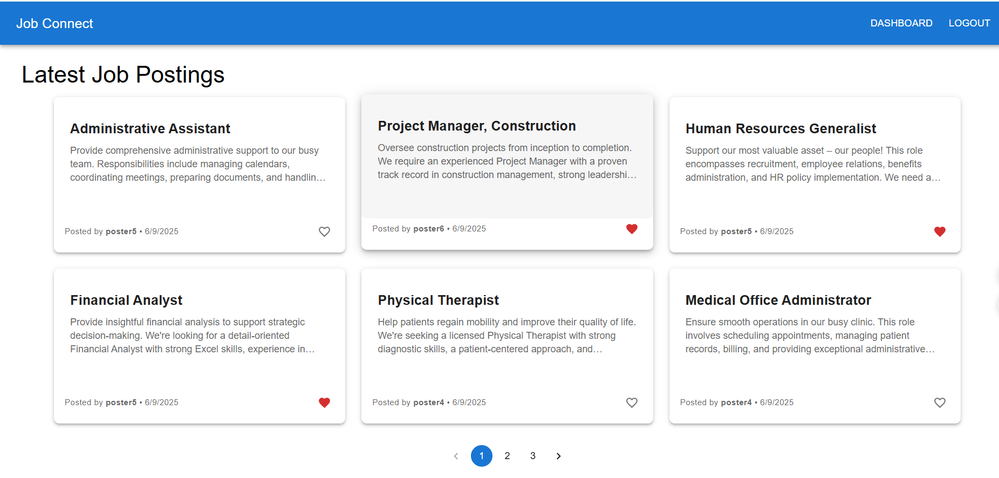

# Job Connect 🧑‍💼💻

Job Connect is a modern full-stack job board application built using **React**, **.NET Core Web API**, **Entity Framework Core**, and **MySQL**. It allows job posters to create and manage listings, while viewers can browse jobs and mark interest.



## ✨ Features

- User Authentication with JWT (Register & Login)
- Role-based Access: Poster vs Viewer
- Job CRUD (Create, Read, Update, Delete) by Posters
- Interest Feature for Viewers (toggle interest on jobs)
- Posters can view interested users
- Auto-expiry of jobs older than 2 months
- Material UI styled components
- Protected Routes with `React Router`
- Pagination on job listing (6 per page, responsive)
- REST API backend built with ASP.NET Core

## 🗂️ Tech Stack

**Frontend**  
- React (Vite)
- React Hook Form
- React Router DOM
- Axios
- Material UI (MUI v5)

**Backend**  
- ASP.NET Core Web API (.NET 8)
- Entity Framework Core
- JWT Authentication
- MySQL

## 🛠️ Setup Instructions

### 1. Clone the Repository
```bash
git clone https://github.com/your-username/job-connect.git
cd job-connect
```
### 2. Backend Setup

To set up and run the backend API:

1.  **Navigate to the Backend Directory:**
    ```bash
    cd backend
    ```

2.  **Configure `appsettings.json`:**
    Open the `appsettings.json` file in the `backend` directory. Update the `DefaultConnection` string with your MySQL database details and set a strong, unique `Key` for JWT.

    ```json
    {
      "ConnectionStrings": {
        "DefaultConnection": "server=localhost;port=3306;user=root;password=your_password;database=JobConnectDb"
      },
      "Jwt": {
        "Key": "YourSuperSecretKey",
        "Issuer": "JobConnectAPI",
        "Audience": "JobConnectClient"
      }
    }
    ```
    * **`DefaultConnection`**: Replace `your_password` with your actual MySQL root password. Ensure your MySQL server is running on `localhost:3306` and a database named `JobConnectDb` exists or will be created by migrations.
    * **`Jwt.Key`**: Replace `YourSuperSecretKey` with a long, random string. This is crucial for the security of your JWTs.

3.  **Apply Database Migrations:**
    This command will apply any pending database migrations, creating the necessary tables and schema in your `JobConnectDb`.

    ```bash
    dotnet ef database update
    ```

4.  **Run the Backend Application:**
    Start the backend API. It will typically run on a default port like `5000` or `5001`.

    ```bash
    dotnet run
    ```

### 3. Frontend Setup

To set up and run the frontend application:

1.  **Navigate to the Frontend Directory:**
    From the `backend` directory, go back one level and then into the `frontend` directory:

    ```bash
    cd ../frontend
    ```

2.  **Install Dependencies:**
    Install all required Node.js packages for the frontend project.

    ```bash
    npm install
    ```

3.  **Run the Development Server:**
    Start the frontend development server. This will typically open the application in your browser at `http://localhost:3000` or similar.

    ```bash
    npm run dev
    ```

---

## 🔐 User Roles

The JobConnect application defines two primary user roles, each with specific capabilities:

| Role     | Capabilities                                 |
| :------- | :------------------------------------------- |
| **poster** | Can create, edit, and delete job listings.   |
| **viewer** | Can browse available job listings and mark/unmark their interest in jobs. |

---

## 📂 Folder Structure

The project follows a modular folder structure to maintain organization and separation of concerns:
```
frontend/
│
├── src/
│   ├── auth/            # AuthContext & Hooks
│   ├── api/             # Axios config
│   ├── components/      # Reusable UI (Navbar, ProtectedRoute, JobCard)
│   ├── features/        # Jobs (JobList, JobForm, MyJobs, EditJob)
│   ├── pages/           # Dashboard, LandingPage
│   └── App.jsx
│
backend/
├── JobConnect.API/      # Web API entry
├── JobConnect.Core/     # DTOs, Interfaces, Entities
├── JobConnect.Data/     # DB Context, EF Config
└── JobConnect.Services/ # AuthService, JobService, InterestService
```
---

## 📧 Contact

For any questions or collaborations, feel free to reach out:

Created by [Ravindra Reddy] ❤️ 

GitHub: [Reddy-Ravindra](https://github.com/Reddy-Ravindra)
